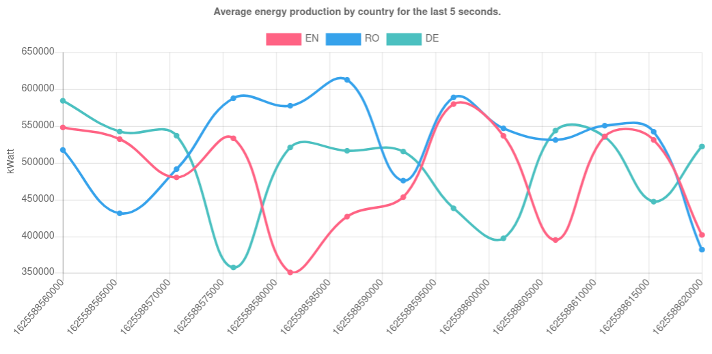

# Kafka Streams Solar Plant Demo
Demo application simulating a solar plant and presenting live event stream analytics in a dashboard

## Start the Kafka cluster and the managing zookeeper nodes

```bash
docker-compose up
```

Ensure that 3 kafka brokers and 3 zookeeper nodes are up and running.

## Start the event producers

```bash
sbt "runMain producers.EnergyTrafficProducer"
sbt "runMain producers.PlantFailureEventProducer"
sbt "runMain producers.WeatherInformationProducer"
```

## Start the aggregating consumer

```bash
sbt "runMain consumers.Consumer"
```

## Start the dashboard

This dashboard has been taken from https://github.com/ebi-wp/kafka-streams-api-websockets
```bash
mvn compile exec:java
```

## The resulting dashboard


